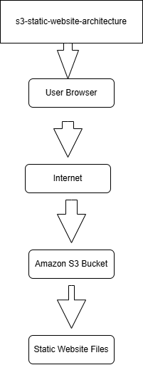
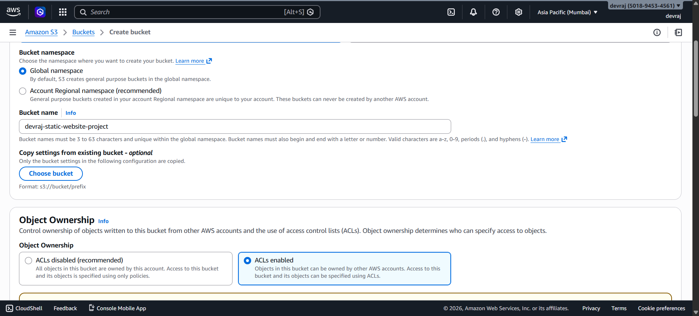
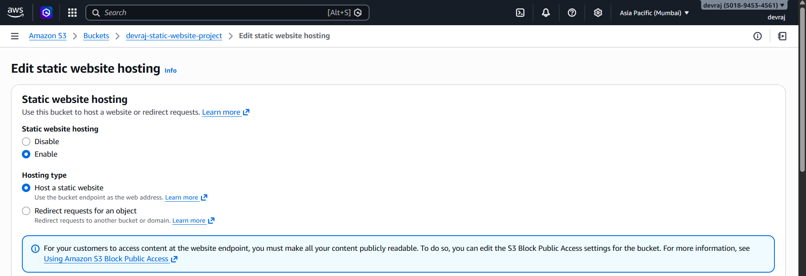
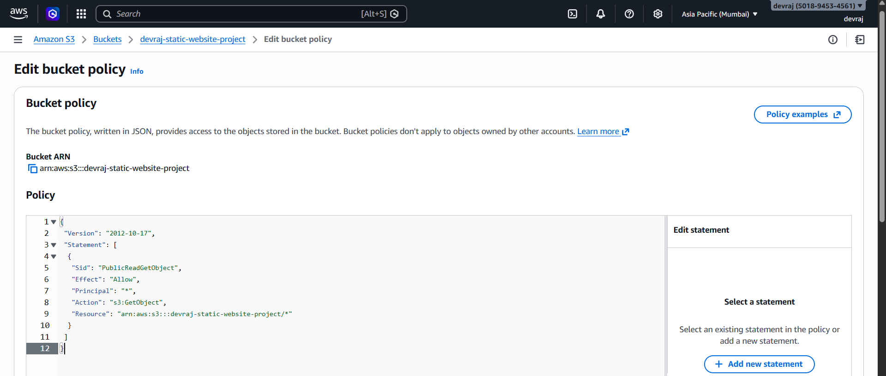
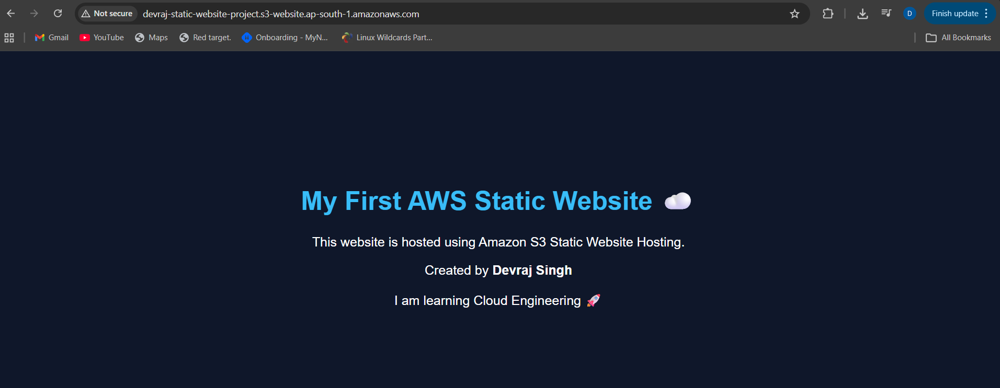

# AWS S3 Static Website Hosting Project

## Project Overview

This project demonstrates how to host a static website using **Amazon S3 Static Website Hosting**.

The website files are stored in an S3 bucket and made publicly accessible using **S3 bucket policies**.

The website is accessed through the **S3 static website endpoint**.

---

## Architecture

User Browser → Internet → Amazon S3 → Static Website

---

## Technologies Used

- Amazon S3
- Static Website Hosting
- Bucket Policy
- HTML
- CSS

---

## Website Files
index.html
style.css
error.html

These files were uploaded to the S3 bucket to host the website.

---

## Implementation Steps

1. Created an S3 bucket
2. Disabled Block Public Access
3. Enabled Static Website Hosting
4. Uploaded website files (HTML and CSS)
5. Configured bucket policy for public access
6. Accessed the website through S3 endpoint

---

## Project Screenshots

### S3 Bucket

---

### Static Website Hosting Enabled

---

### Bucket Policy

---

### Website Running

---

## Learning Outcomes

Through this project I learned:

- How Amazon S3 can host static websites
- How bucket policies control public access
- How static website hosting works in AWS
- How cloud services can replace traditional web servers

---

## Author

Devraj Singh  
Cloud Engineering Learner
